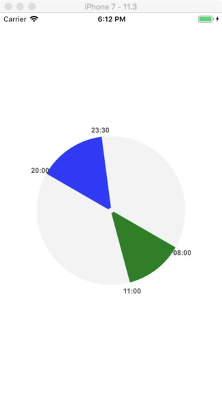
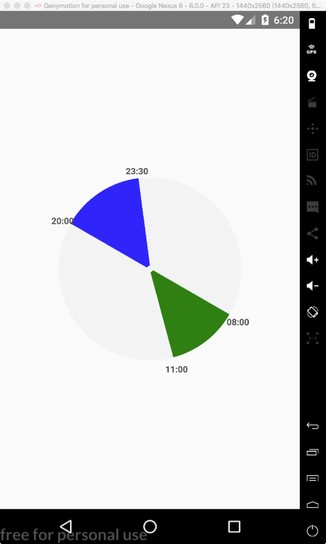
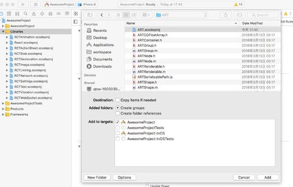
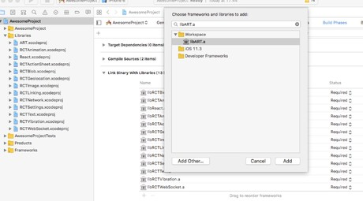

# react-native-time-pie

[](https://www.npmjs.org/package/react-native-textarea)
[](https://www.npmjs.com/package/react-native-textarea)

## 运行效果





## 添加依赖
Android默认就包含ART库，IOS需要单独添加依赖库。

1. 使用xcode中打开react-native中的ios项目，选中`Libraries`目录 ——> 右键选择`Add Files to 项目名称` ——> `node_modules/react-native/Libraries/ART/ART.xcodeproj` 添加；



2. 选中项目根目录 ——> 点击`Build Phases` ——> 点击`Link Binary With Libraries` ——> 点击左下方`+` ——> 选中`libART.a`添加。



## 安装和使用

1. 使用`npm`安装:

```bash
$ npm install --save react-native-time-pie
```

2. 导入组件:

```js
import Pie from 'react-native-time-pie';
```

3. 使用组件:

```js
...
  render() {
    const foo = { startTime: '08:00', endTime: '11:00', fillColor: 'green' };
    const bar = { startTime: '20:00', endTime: '23:30', fillColor: 'blue' };
    const pieData = [foo, bar];

    return (
      <View style={styles.container}>
        <Pie 
          data={pieData}
        />
      </View>
    );
  }
...

const styles = StyleSheet.create({
  container: {
    flex: 1,
    padding: 30,
    justifyContent: 'center',
    alignItems: 'center',
  },
});
```
